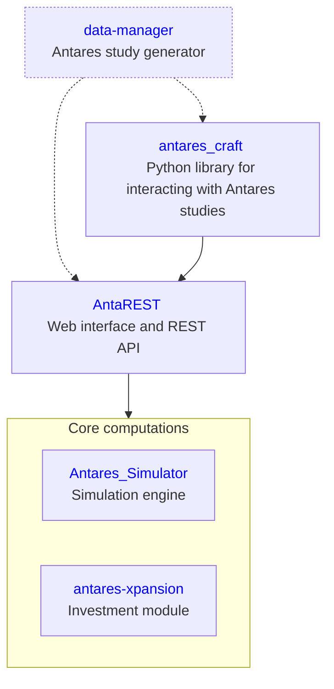

# Antares

## Overview

Antares is composed of multiple programs that form a comprehensive ecosystem for 
simulating transmission systems at short- or long-term horizons. Its aim is to:
- Precisely quantify the adequacy and economic performance of national 
  or continental interconnected energy systems
- Perform investment optimization to anticipate the future development of the grid

## Main applications

You can find a more functional diagram 
[here](https://antares-doc.readthedocs.io/en/latest/overview/architecture/).

## Links

:book: [Antares documentation](https://antares-doc.readthedocs.io/en/latest/)

:new: [Release notes](https://antares-doc.readthedocs.io/en/latest/overview/changelogs/)

